## Introduction

This lab introduces you to the tools you will use throughout the course. It consists of three parts:

1. **Server**. This part will introduce you to the remote server machine, how to connect to your server, how to use remote desktop clients, and how to run JupyterLab on the server. You will also learn to use SSH/SCP and clone the course repository.

2. **Introduction to Linux**. This part will introduce you to the basic concepts of Linux and the command line interface. You will learn to navigate the file system and use the essential commands.

3. **Optional**. This part is optional, and you can skip it. This part will help you set up a local virtual machine on your computer and introduce you to another option to have a remote desktop client.


# Milestone 1 -- Server


In this course, you will use a server that runs a distribution of Linux called Ubuntu. You will use a server hosted on the NTNU server infrastructure. These servers are available 24/7 and can be accessed via NTNU's internal network. If you are not on campus, you can connect to the server using the [NTNU VPN](https://i.ntnu.no/wiki/-/wiki/norsk/installere+vpn).


## 1.1 Connecting to the Server

* You can access the server through SSH by running the following command in a terminal: `ssh ttm4200@<your_server_IP_address>`.

    >_You can find your server IP address and password in "Group Description on the Blackboard". If you have Windows, use a PC from the Sahara lab._ 

* You can exit the server by typing the following command in the terminal: `exit`.

    >_The connection to the server is closed._


### SSH Key

Instead of using the password every time you connect to the server, you can use an SSH key:

- Generate an SSH key **in your computer**:

```bash
ssh-keygen -t ed25519 -f ~/.ssh/<key_name> -C "<your_email>"
```
>_Replace `<key_name>` with a name for the key, and `<your_email>` with your email address. In all the following commands, you need to replace what is inside `<...>` with your own values._

>_You will be asked to enter a passphrase to protect the key. Leave it empty for now. This will generate two files: `~/.ssh/<key_name>` and `~/.ssh/<key_name>.pub`. The first file is the private key, and the second file is the public key._

- Copy the public key to the server, and add it to the authorized keys file:

```bash
# In your computer
scp ~/.ssh/<key_name>.pub ttm4200@<your_server_IP_address>:~/.ssh/
# Now, connect to the remote server
cat ~/.ssh/<key_name>.pub >> ~/.ssh/authorized_keys
```

>_Alternatively, you can use the following single command in your computer:_
```bah
cat ~/.ssh/<key_name>.pub | ssh ttm4200@<your_server_IP_address> 'cat >> ~/.ssh/authorized_keys'
```

- Connect to the server using the private key:

```bash
ssh -i ~/.ssh/<key_name> ttm4200@<your_server_IP_address>
```

### SSH Config

Instead of typing the username and the IP address every time you connect to the server, you can add the following lines to your `~/.ssh/config` file:

```bash
Host ntnu_server
    HostName <your_server_IP_address>
    User ttm4200
    IdentityFile ~/.ssh/<key_name>
```
>_If you have not used SSH before, you may not have a `~/.ssh/config` file. You can create it by running `touch ~/.ssh/config`._

Then, you can connect to the server by running `ssh ntnu_server`.

### Copying Files to/from the Virtual Machine

You can use `scp` to copy files and directories to/from the server. For example:

- To copy a file to the server: `scp <local_file> ntnu_server:~/<destination_directory>`.

- To copy file from the server: `scp ntnu_server:~/<source_file> <local_directory>`.

- To copy directories add the `-r` flag: `scp -r <local_directory> ntnu_server:~/<destination_directory>`.


**Task: show your TA that you can connect to the server using `ssh ntnu_server`**

**Task: show your TA that you can copy a file to/from the server using `scp`**

**Task: show your TA that you can copy a directory to/from the server using `scp`**


## 1.2 Running JupyterLab on the Server

[JupyterLab](https://jupyterlab.readthedocs.io/en/stable/) is a web-based interactive development environment for Jupyter notebooks, code, and data. You can run JupyterLab on the server and access it from your computer. To do so, you need to establish an [SSH tunnel](https://goteleport.com/blog/ssh-tunneling-explained/) from your computer to the server.

* On your computer, run the following command: 

```bash
ssh ntnu_server -L 8888:localhost:8888
```
>_This will establish an SSH tunnel from port 8888 in your computer to port 8888 in the server. The first port number is the port in your computer, and the second port is the port in the server. You can use any port number above 1024 and below 65535. You can also use different port numbers for the two ports, but using the same port number is easier._

* In the **server**, start JupyterLab:

```bash
jupyter lab --no-browser --port=8888
```
>_The port number should be the same as the second port number in the SSH tunnel._

* In your computer browser, type `localhost:8888` to show JupyterLab. You can now use JupyterLab as you would do on your computer, but it is actually running on the server.

>_The port number should be the same as the first port number in the SSH tunnel. If JupyterLab asks you for a token, you can find it in the terminal where you started JupyterLab in the server._


## 1.3 [Remote Desktop Client](https://en.wikipedia.org/wiki/Remote_desktop_software)

Some of the tools you will use in this course require a graphical user interface, such as Wireshark. You can use the server with a graphical user interface by connecting to it using a remote desktop client. Several options are available, but we recommend using [Xpra](https://xpra.org/).

Xpra allows you to remotely connect to a graphical desktop session without installing any software on your computer. It is the easiest option because it uses HTML5 and does not require any configuration. It is also faster than X2Go or VNC.

* Open a terminal in your computer and establish an ssh tunnel to the server:

```bash
ssh ntnu_server -L 7777:localhost:7777
```

* On the server, run the following command to start Xpra:

```bash
xpra start --bind-tcp=0.0.0.0:7777 --html=on --start=gnome-terminal
```

* Open a browser on your computer and type `localhost:7777` to show the graphical desktop session. You can now use the graphical desktop session as you would on your computer, but it is actually running on the server. You can open any application that you want from the terminal in the browser, for example:

```bash
wireshark &
```


## 1.4 Course Repository

We will use a [Git](https://en.wikipedia.org/wiki/Git) repository to distribute the course material throughout the semester. 

* Clone the coure repository to your **server** using the following command:

```bash
git clone https://github.com/ntnuttm4200/labs_2023.git /home/ttm4200/labs
```
This will create a folder named "labs" in your home directory. You can find the course material in this folder.

* To get the latest version of the course material, run the following command. **You need to run this command at the beginning of each lab**.

```bash
cd ~/labs
git pull origin main
```


# Milestone 2 -- Introduction to Linux

* Run JupyterLab in the server and open the notebook `~/labs/00-lab0/tasks.ipynb`. Follow the instructions in the notebook to complete the tasks. We will use JupyterLab for the rest of the course.

\newpage

# Optional

## Local Virtual Machine (Optional)

In addition to the server, you can also use a local virtual machine on your own computer. This is optional, and we will **not** provide support for it.

* Start with downloading and installing [VirtualBox](https://www.virtualbox.org/wiki/Downloads)(https://www.virtualbox.org/wiki/Downloads) if you don't have it already. Choose the "platform packages" according to your operating system (If you do not know how to install it, see this link: https://www.wikihow.com/Install-VirtualBox).

* Download the VM image "ttm4200.ova"[Link](https://filesender.sikt.no/?s=download&token=ebd8e0d4-9fa0-475e-bea3-91636ac16f2f) (<https://filesender.sikt.no/?s=download&token=ebd8e0d4-9fa0-475e-bea3-91636ac16f2f>). This VM image contains the software configuration, including an operating system and other packages that we will use in this course. This is the same image that we use in the "ntnu_server".

* Open VirtualBox and select **Tools** $\rightarrow$ **Import**. In the "Appliance to import" window, set the **Source** to be **Local File System** and  the **File** to be the path to the downloaded **ttm4200.ova**. Then $\rightarrow$ **Next** $\rightarrow$ **import**. 

    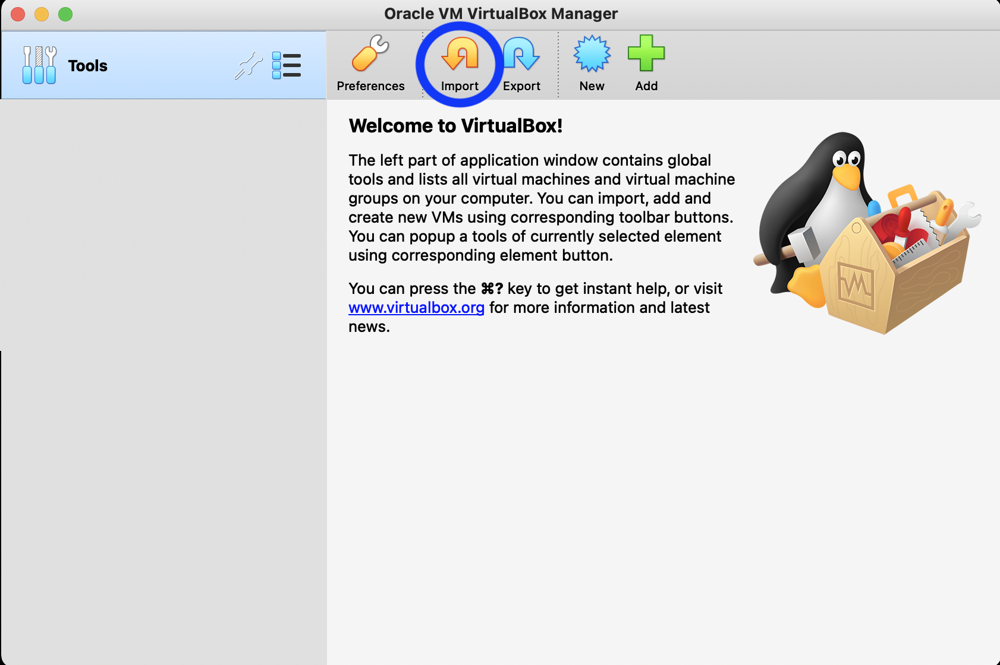{ width=70% }

    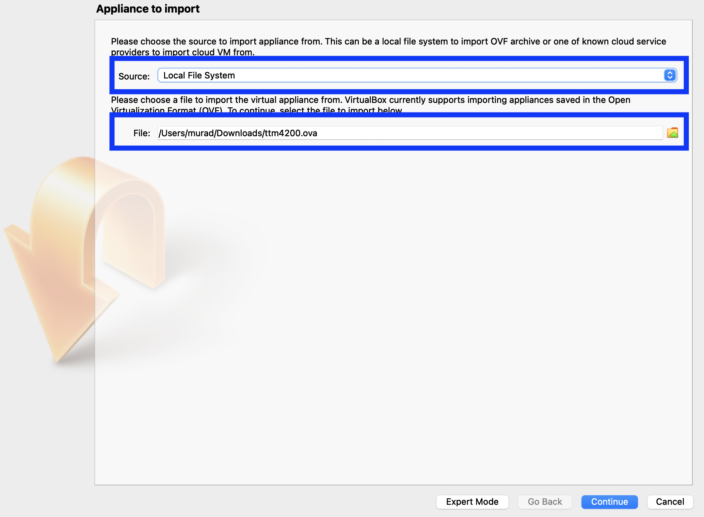{ width=70% }


* After the import is done, select **ttm4200** $\rightarrow$ **Settings** $\rightarrow$ **System**. Allocate enough "Base Memory" to the VM depending on your computer. There should be enough remaining for the host machine. For example, for a computer with 16 GB RAM, you can allocate 8 GB (8192 MB) to the VM.


    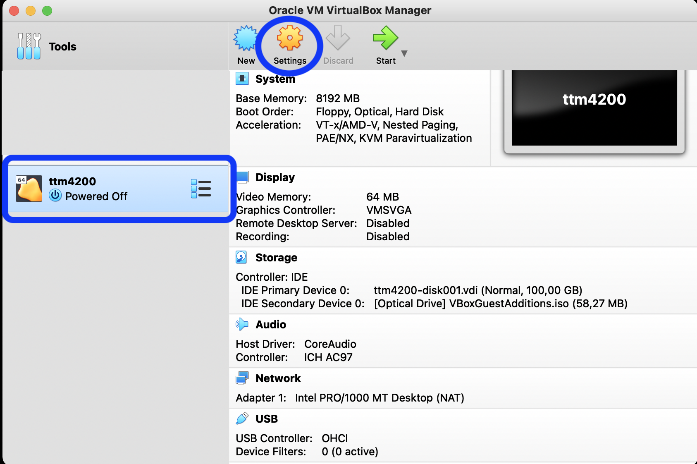{ width=70% }

    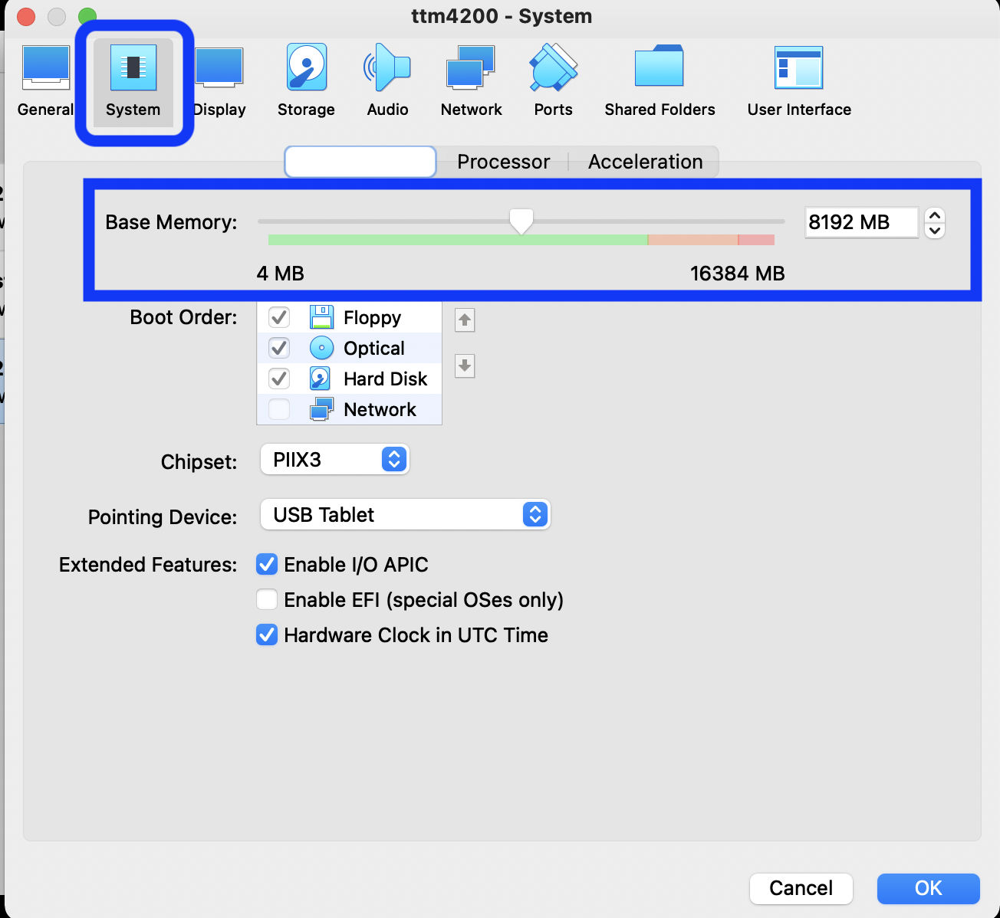{ width=60% }


* To access files on your computer from within the VM, you can share folders between them. Select **Shared Folders** $\rightarrow$ **Add new shared folder** (small icon on the right). Set **Folder Path** to a folder you want to share in your computer and set **Folder Name** to be "shared_folder," then select **Auto-mount**.

    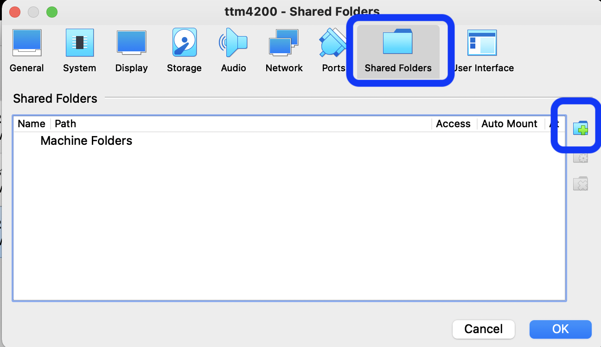{ width=70% }

    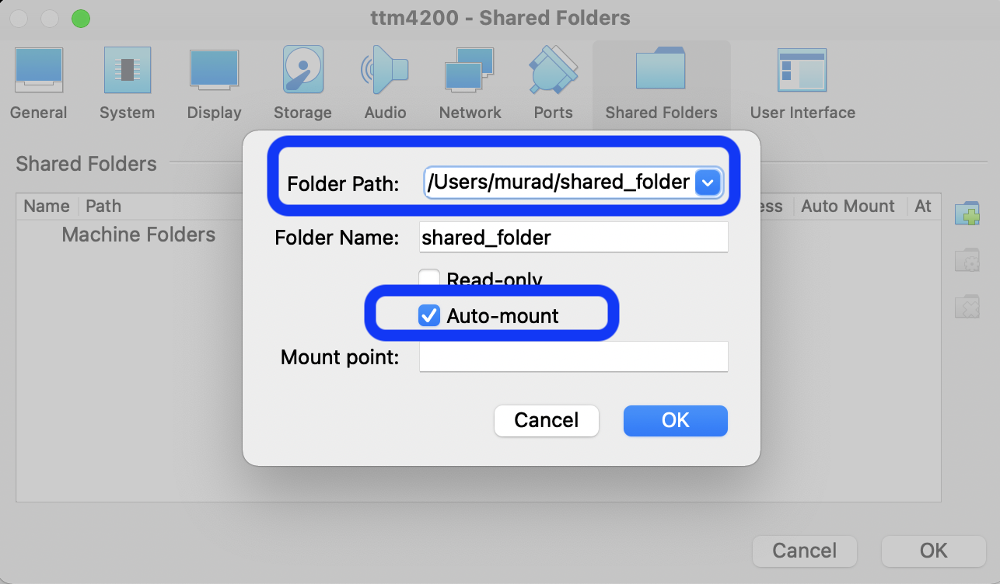{ width=70% }

* Start the VM and log in using the password "ttm4200". 

* Change the password using [`passwd`](<https://www.cyberciti.biz/faq/linux-set-change-password-how-to/>).

* By default, the shared folder will be mounted to "/media/sf_shared_folder/" (if Auto-mount is selected). You can create a symbolic link to the home directory for easier access. 

    ```
    ln -s /media/sf_shared_folder/ shared_folder
    ```

## [X2Go](https://wiki.x2go.org/doku.php/doc:newtox2go) (Optional)

Another option to access the server is to use X2Go. X2Go allows you to have a remote connection to a graphical desktop session, but it can be slow depending on your Internet bandwidth.

* Install the X2Go client on your computer. Installing instructions are available at: <https://wiki.x2go.org/doku.php/doc:installation:x2goclient/>.

* Lunch the X2Go client and create a new session:

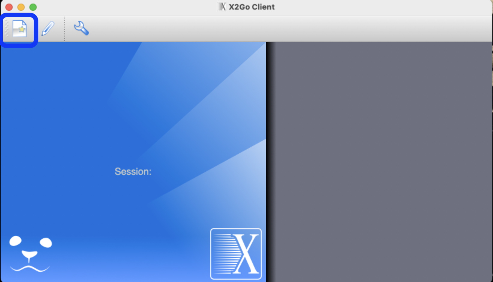{ width=40% }

* Fill in "Host" with your server IP address. The "Login" is the username,  which is "ttm4200". Select "XFCE in the session type.

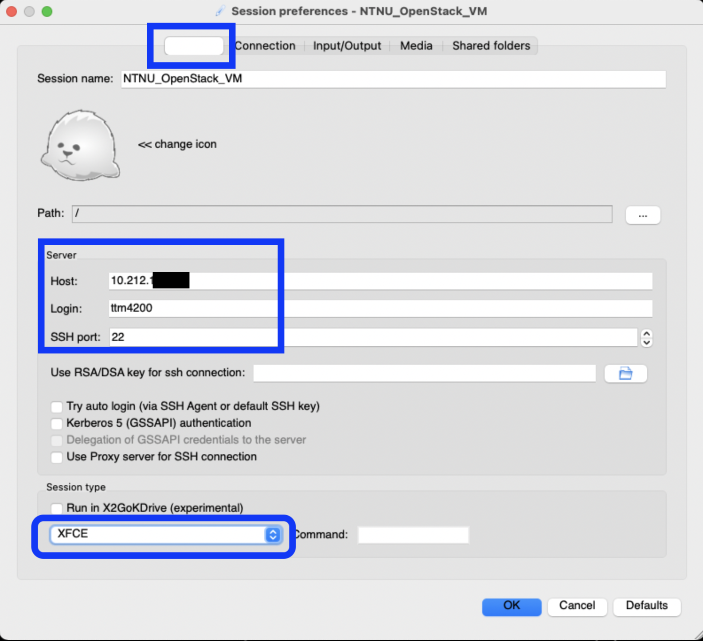{ width=40% }

* Disable sound and printing support:

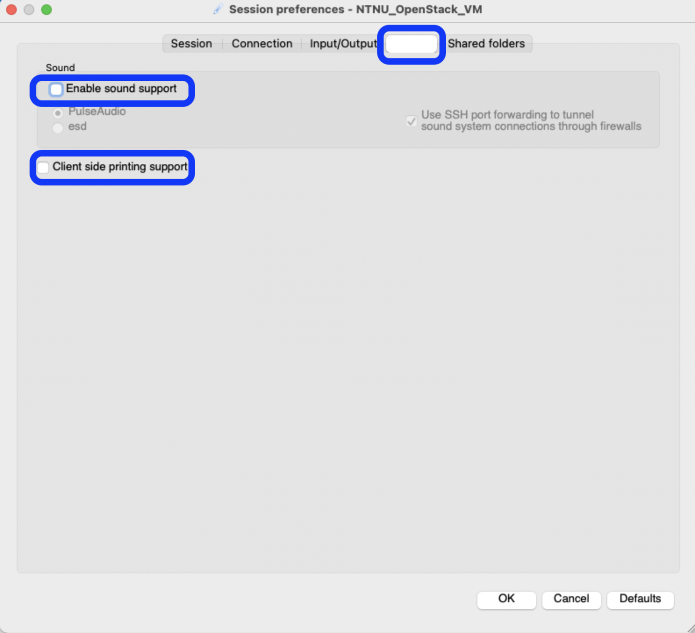{ width=40% }

* For convenient file exchange between your computer and the server, you can share a folder between them. The shared folder will be mounted at (/tmp/.x2go-ttm4200/media/disk/...).

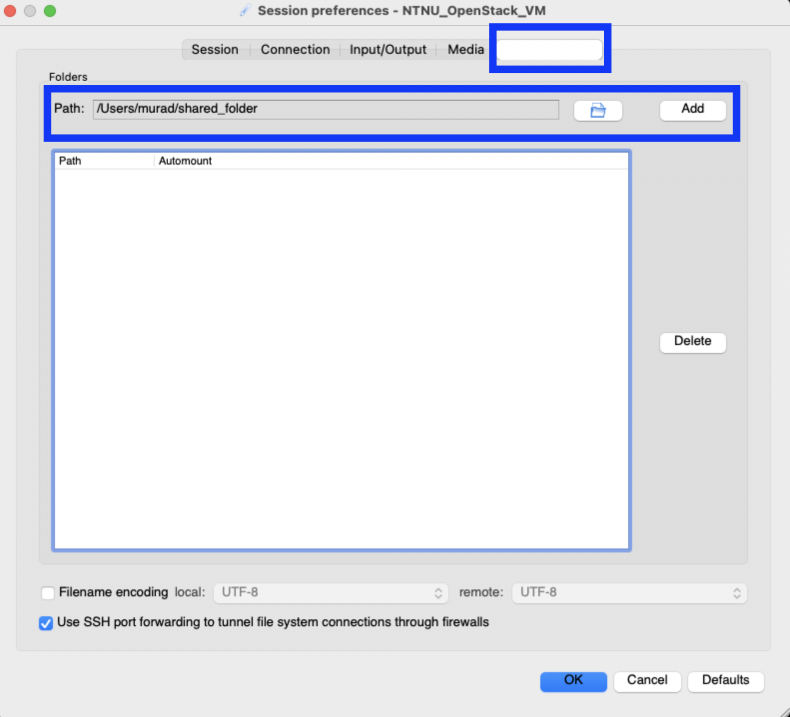{ width=40% }

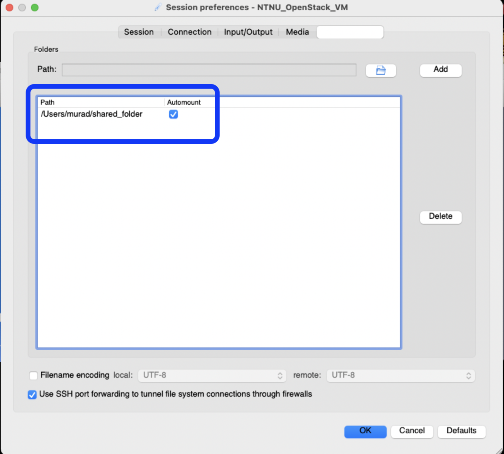{ width=40% }


* After completing the setup, click on the newly created session and input the password of the server:

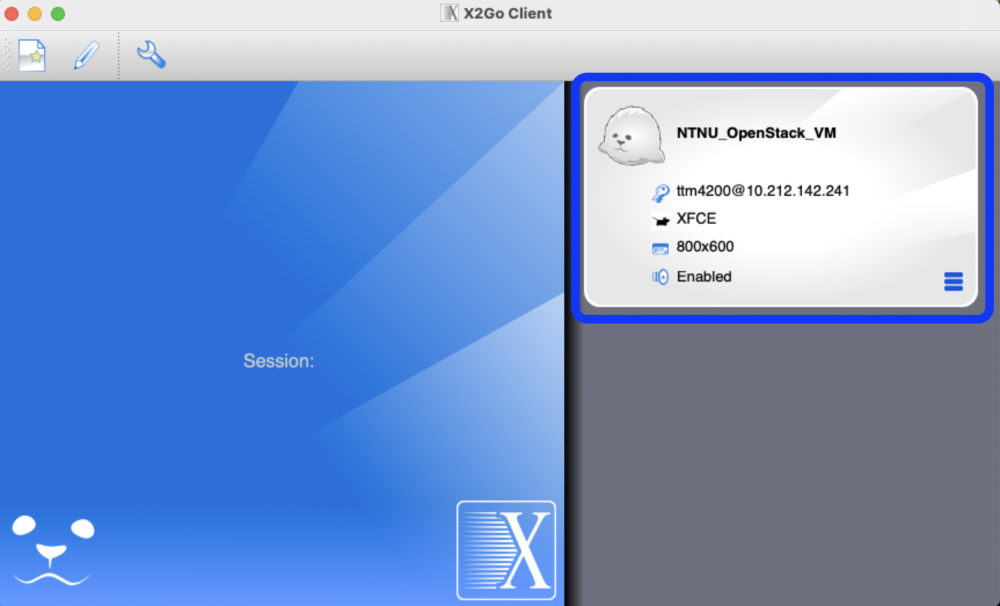{ width=40% }

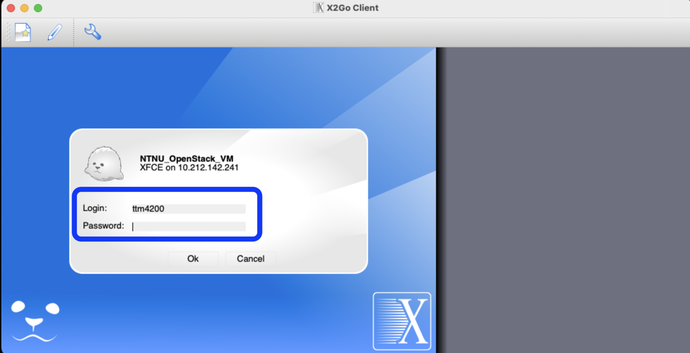{ width=40% }


* Now, you are able to interact with the server in the same way as if you would set it up locally:

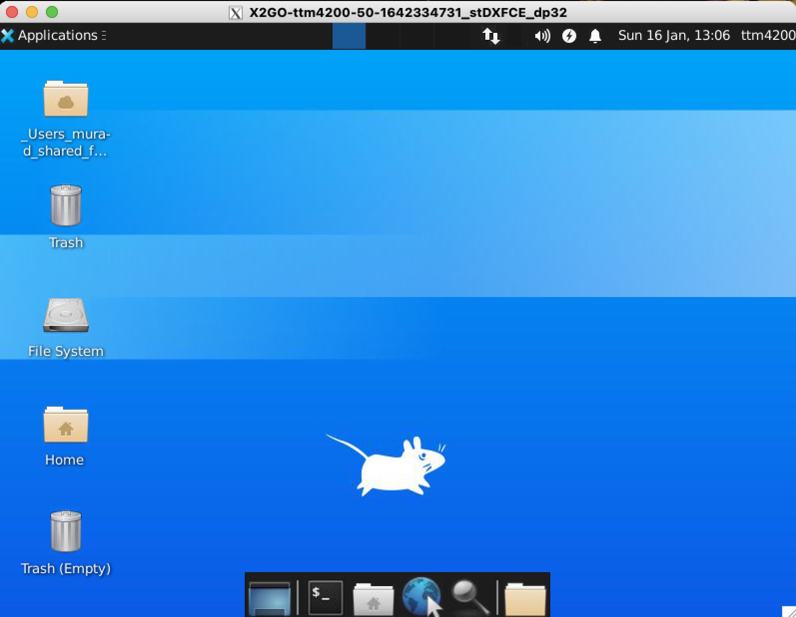{ width=40% }

