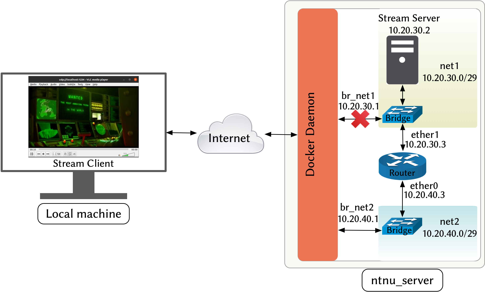

# Lab 4 Part 1 -- Transport Layer (connectionless vs oriented)

This lab aims to introduce you to the transport layer protocols. In particular, we will focus on the difference between connectionless and connection-oriented protocols. We will use TCP as an example of a connection-oriented protocol and UDP as an example of a connectionless protocol. You will analyze and compare the performance of these protocols under normal network conditions and network conditions subject to packet loss, corruption, congestion, and delay.

For delivery, submit a PDF report where you answer **only** those questions marked with a **REPORT:**. 

## Lab Setup

[Figure 1](#figure_1) shows the topology of the lab. You will use the lab setup for the following scenarios:

- Stream a video file from the "server" container.

- Play the video stream from your local machine as the streaming client.

- Manipulate the network traffic in the "router" container.


<a id='figure_1'></a>

||
|:--:|
| *Figure 1: Lab4 System Setup* |

- The topology in [Figure 1](#figure_1) is defined in the "docker-compose.yml" file.  Read the "docker-compose.yml" file to understand the lab setup. 

- Stop and remove the containers and networks created by the previous lab before starting this lab. 

```bash
cd ~/lab/lab2
docker-compose down
cd ~/lab/lab4
sudo apt-get install socat
sudo apt-get install traceroute
docker-compose up -d --build
```

- You will manipulate the network traffic in the "router" container. To ensure that the traffic between the "ntnu_server" and the streaming server passes through the router, you will need to delete the direct connection between the "ntnu_server" and the streaming server and add a route through the router:

```bash
# On the "ntnu_server"
sudo ip route del 10.20.30.0/29
sudo ip route add 10.20.30.0/29 via 10.20.40.3
```

- Validate that the traffic between the "ntnu_server" and the streaming server passes through the router: 

```bash
# On the "ntnu_server"
traceroute 10.20.30.2
```

```python
from test_lab4_part1 import TestLab4_part1
check_progress = TestLab4_part1()
check_progress.test_1_1()
```

- Since manipulating the network traffic will affect `ssh` connections, we recommend that you use `docker attach` to attach to the containers. 

>NOTE: Using `ssh` to connect to the containers will be slow but correct even when applying packet loss or packet corruption since `ssh` is connection-oriented. If you use `docker attach`, do not kill the container when exiting (by pressing `Ctrl+c` or typing `exit`); use detach instead (press `Ctrl+p` followed by `Ctrl+q`)


# Milestone 1 -- Video Streaming

In this milestone, you will stream a video file from the "server" container to your local machine under normal network conditions. You will use [VLC](https://en.wikipedia.org/wiki/VLC_media_player) to both stream the video file and play the video stream. VLC is a free and [open-source](https://github.com/videolan/vlc) media player and streaming media server.

## Task1.1 -- TCP stream

- On the **"server"** container, start a TCP stream using the following command:
  - `cvlc` is the VLC command line interface.
  - `~/work_dir/frog.mp4` is the path to the video file.
  - `--loop` will loop the video (i.e., restart the video when it finishes).
  - `--sout` specifies the stream output.
  - `#std` specifies the standard output.
  - `access=http` specifies the protocol used to stream the video. In this case, we use HTTP (TCP).
  - `mux=ts` specifies the encapsulation method used for the resulting stream. In this case, we use MPEG2-TS (suitable for mp4 files).
  - `bind=10.20.30.2:9080` binds the server's socket to server's IP and a port. The server's socket is the socket that VLC will create and listen on.

```bash
cvlc  ~/work_dir/frog.mp4 --loop --sout '#std{access=http,mux=ts,bind=10.20.30.2:9080}'
```

>You will see some error messages related to the fact that the server has no GUI, such as "D-Bus" and "interface" or a sound daemon such as "PulseAudio". Ignore these error messages.


- On your **local machine**, start an ssh tunnel to the server's socket:

```bash
ssh ntnu_server -L 1234:10.20.30.2:9080
```

- On your **local machine**, play the the video stream:

```bash
vlc http://localhost:1234 --network-caching=1000
```

- The `--network-caching` option specifies VLC cache size in milliseconds. The cache is a buffer that stores the video stream before playing it. The default cache size is 1000 ms. This means that VLC will download 1 second of the video stream before playing it to avoid the video from stopping while the stream is being downloaded. 

- Try different cache sizes (e.g., 0, 100, 1000, 10000, 100000) and observe the effect on the video quality.

- Stop the video player and exit the ssh tunnel.

- For the rest of the lab, use the following command to start the ssh tunnel (in the background) and play the video in one command. The tunnel will automatically close after you terminate the video player.
  - `-f`: Put the ssh tunnel in the background.
  - `-o ExitOnForwardFailure=yes`: terminate the tunnel when the port forwarding is not in use (e.g., when the video player is terminated).
  - `sleep 1`: wait until the connection is there and the ports are open before going into the background.

```bash
ssh -f -o ExitOnForwardFailure=yes ntnu_server -L 1234:10.20.30.2:9080 "sleep 1" && vlc http://localhost:1234 --network-caching=100
```

## Task 1.2 -- UDP stream

- On the **"server"** container, start a UDP stream using the following command:
  - `--sout-keep` option: keep the UPD stream open.
  - `access=udp` specifies UDP as the streaming protocol.
  - `dst=10.20.40.1:9080` specifies the destination IP address and port for the UDP packets. In this case, the destination is the "ntnu_server." Notice the difference between UDP and TCP: in TCP, the server listens on a socket (binds a socket to the server's IP address), and the client connects to that socket. In UDP, the server sends packets to a destination IP address and port without binding any socket to its address.

```bash
cvlc ~/work_dir/frog.mp4 --loop --sout-keep --sout '#std{access=udp,mux=ts,dst=10.20.40.1:9080}'
```

- On your **local machine**, run the following command to start an ssh tunnel and play the video:
  - `socat UDP4-LISTEN:9080, TCP4:localhost:7080`: transfer UDP packets from UDP port 9080 to TCP port 7080 on the "ntnu\_server". 
  - `ssh ... -R 10.20.40.1:7080:localhost:6080`: reverse ssh tunnel from the "ntnu_server" to your local machine. The tunnel will forward the packets from TCP port 7080 on the "ntnu_server" to TCP port 6080 on your local machine.
  - `socat TCP4-LISTEN:6080, UDP4:localhost:1234`: transfer the packets from TCP port 6080 to UDP port 1234 on your local machine. 
  - `vlc udp://@localhost:1234`: VLC player will receive the UDP packets on UDP port 1234 and play the video.

```bash
socat TCP4-LISTEN:6080, UDP4:localhost:1234 & ssh -f -o ExitOnForwardFailure=yes ntnu_server -R 10.20.40.1:7080:localhost:6080 "sleep 1 && socat UDP4-LISTEN:9080, TCP4:localhost:7080" & vlc udp://@localhost:1234 --network-caching=100 && fg
```

>Note: Do not worry about the meaning of the command. The main idea is that we are using [`socat`](https://www.redhat.com/sysadmin/getting-started-socat) to send UDP packets through an ssh tunnel, which is not possible by default because ssh is a connection-oriented.

- Try different cache sizes (e.g., 0, 100, 1000, 10000, 100000) and observe the effect on the video quality.

Q1. **REPORT:** Briefly compare the effect of the cache size on the video quality for the TCP and UDP streams. Give reasons for your observations based on the fundamentals of TCP and UDP.

## Task 1.3 -- Traffic Capture

- Stop if there is any stream running on the **"server"** container.

- On the **"ntnu_server"**, start capturing network traffic on the interface **"br_net2"**:

```bash
sudo tcpdump -i br_net2 -w tcp_normal_traffic.pcap
```

- On the **"server"** container, start a TCP stream.

- On your **local machine**, play the video stream.

- Stop the video player and the stream after a few seconds. Then, stop the tcpdump on the **"ntnu_server"**. Save the pcap file to your local machine.

- Repeat the above steps for the UDP stream. Name the pcap file as `udp_normal_traffic.pcap` and save it to your local machine.

- You will use these pcap files ("tcp_normal_traffic.pcap" and "udp_normal_traffic.pcap") in the following milestones as the baseline for comparison. They represent network traffic under _normal_ conditions.


# Milestone 2 -- Packet Loss

##  Background -- Traffic Control

Linux [traffic control](https://tldp.org/HOWTO/Traffic-Control-HOWTO/overview.html) is a powerful tool to manipulate your network traffic. This tool is useful for a network administrator to implement network policies, such as traffic shaping, scheduling and policing. For example, you can use it to ensure fair use of bandwidth among users, prioritize the traffic of a specific application, or block a particular application.

In this lab, you will use the [`tc`](https://man7.org/linux/man-pages/man8/tc.8.html) command to configure traffic control in the "router" container. You will use [`tc-netem`](https://man7.org/linux/man-pages/man8/tc-netem.8.html) command to "emulate" different types of network conditions, such as packet loss, packet corruption, bandwidth limitation, and latency. This can be useful when you want to test how your application behaves under different network conditions.

The format of the `tc` command is as follows:

```bash
sudo tc qdisc add/del/replace dev ether0 root netem delay/loss/corrupt 100ms/10%/10%
```

Where:

- `tc`: traffic control command.

- `qdisc`(queueing discipline): simply a queue for outbound data packets and a scheduler on a network interface that decides which packet to send next (FIFO, priority-based, etc.).

- `add/del/replace`: add, delete, or replace a traffic control rule.

- `dev`: specify the network interface.

- `root`: attach the traffic control rule to the root qdisc. You will only use the root qdisc in this lab, but it is possible to attach the traffic control rule to different classes of the qdisc.

- [`netem`](https://wiki.linuxfoundation.org/networking/netem): network emulator that allows you to emulate different types of network conditions.

- `delay/loss/corrupt 100ms/10%/10%`: specify the network condition type and the condition amount.

All the traffic control rules in this lab are applied to the egress scheduler only. This means that the traffic control rules apply to the packets sent from the "router" container to the "ntnu_server," not vice versa.


## Task 2.1 -- Streaming under Packet Loss

- In the **"router"** container, introduce a packet loss of 5% on the interface **"ether0"**:

```bash
sudo tc qdisc add dev ether0 root netem loss 5%
```

- Stream and play the video over TCP (as you did in Milestone 1) and observe the video quality. Try to change the amount of packet loss until you see a noticeable difference:

```bash
sudo tc qdisc replace dev ether0 root netem loss [amount_of_packet_loss%]
```

- Repeat the above steps for UDP and observe the video quality. Try to change the amount of packet loss until you see a noticeable difference.


- You can remove any traffic control rule with this command in case you want to restart:

```bash
sudo tc qdisc del dev ether0 root
```

Q2. **REPORT:** Briefly describe and compare what happens to the video stream under packet loss vs normal network conditions for both TCP and UDP. Give reasons for your observations based on the fundamentals of TCP and UDP.

## Task 2.2 -- Analyzing traffic under packet loss

Now, you will capture and analyze packets in the presence of packet loss. You will capture packets in the server (before the router, thus before applying packet loss) and in your "ntnu_server" (after the router, thus after applying packet loss). Refer to [figure 1](#figure_1) to understand the network topology and why we capture packets in these two places.

### TCP

- On the **"server"** container, start capturing packets on the interface **"eth0"**:

```bash
sudo tcpdump -i eth0 -w tcp_before_loss.pcap
```

- On the **"ntnu_server"**, start capturing packets on the interface **"br_net2"**:

```bash
sudo tcpdump -i br_net2 -w tcp_after_loss.pcap
```

- On the **"router"** container, introduce a packet loss of 20% on the interface **"ether0"**:

```bash
sudo tc qdisc replace dev ether0 root netem loss 20%
```

- Then stream and play the video over TCP and stop the streaming after a short time (e.g., 30 seconds). Stop the packet capturing on both the **"server"** and the **"ntnu_server"**. Save the pcap files to your local machine.

- Open the capture files (**"tcp_after_loss.pcap"** and **"tcp_normal_traffic.pcap"**) in Wireshark. Then answer the following questions and validate your answer with a screenshot. You can apply a display filter to show only the packets exchanged between the server and the client, for example: `ip.addr eq 10.20.30.2 and ip.addr eq 10.20.40.1`.

Q3. **REPORT:** Compare the captured TCP packets in the presence of packet loss vs. normal network conditions. What is the difference between the two? Why do you think this is happening?

>HINT: You can apply these display filters: `tcp.analysis.lost_segment` to indicate any gap in sequence numbers, and `tcp.analysis.retransmission` to display all retransmissions.


- Open the capture files (**"tcp_before_loss.pcap"** and **"tcp_after_loss.pcap"**) in Wireshark. Then answer the following questions and validate your answer with a screenshot.

Q4. **REPORT:** Compare the captured TCP packets before and after applying packet loss. What is the difference between the two? Why do you think this is happening?

>HINT: In Wireshark, navigate to **Analyze**$\rightarrow$**[Expert Information](https://www.wireshark.org/docs/wsug_html_chunked/ChAdvExpert.html)**. This will give you a summary of network behavior; thus, you can find network issues easier than inspecting the packet list.


### UDP

- On the **"server"** container, start capturing packets on the interface **"eth0"**:

```bash
sudo tcpdump -i eth0 -w udp_before_loss.pcap
```

- On the **"ntnu_server"**, start capturing packets on the interface **"br_net2"**:

```bash
sudo tcpdump -i br_net2 -w udp_after_loss.pcap
```

- On the **"router"** container, introduce a packet loss of 20% on the interface **"ether0"**:

```bash
sudo tc qdisc replace dev ether0 root netem loss 20%
```

- Then stream and play the video over UDP and stop the streaming after a short time (e.g., 30 seconds). Stop the packet capturing on the **"server"** and the **"ntnu_server"**. Save the pcap files to your local machine.

- Open the capture files (**"udp_before_loss.pcap"** and **"udp_after_loss.pcap"**) in Wireshark. Then answer the following questions and validate your answer with a screenshot.

Q5. **REPORT:** Compare the captured UDP packets before and after applying packet loss. Can you see any difference between the two? Is there any mechanism in the UDP protocol that lets you track packets and detect packet loss?

- Remove any traffic control rule in the router:

```bash
sudo tc qdisc del dev ether0 root
```

# Milestone 3 -- Packet Corruption

## Task 3.1 -- Streaming under Packet Corruption

- In the **"router"** container, introduce a packet corruption of 5% on the interface **"ether0"**:

```bash
sudo tc qdisc add dev ether0 root netem corrupt 5%
```

- Stream and play the video over TCP  and observe the video quality. Try to change the amount of packet corruption until you see a noticeable difference:

```bash
sudo tc qdisc replace dev ether0 root netem corrupt [amount_of_packet_corruption%]
```

- Repeat the above steps for UDP and observe the video quality. Try to change the amount of packet corruption until you see a noticeable difference.

Q6. **REPORT:** Briefly describe and compare what happens to the video stream under packet corruption vs. normal network conditions for TCP and UDP. Give reasons for your observations based on the fundamentals of TCP and UDP.


Q7. **REPORT:** Do you see any difference between the video quality when applying packet corruption vs. packet loss for TCP and UDP? Do you see the corruption in the video? Why?

> [HINT](https://linux-tips.com/t/how-to-disable-udp-checksum-control-in-kernel/362)

## Task 3.2 -- Analyzing traffic under Packet Corruption

Q8. **Extra Credit:** Perform a similar analysis as in Milestone 2 (task 2.2), but this time under packet corruption. Try to find other analysis tools/techniques that can help you understand the behavior of the network under packet corruption.

# Milestone 4 -- Bandwidth Limis


## Task 4.1 -- Throughput Analysis


When analyzing the required bandwidth (maximum transfer capacity of a network), you need to know the throughput of your application. In this milestone, you need to know the amounts of packets produced by the streaming server (in bits/second). You can use Wireshark [I/O Graph](https://www.wireshark.org/docs/wsug_html_chunked/ChStatIOGraphs.html) to see the throughput (as a graph over time).

- Open the capture file (**"tcp_normal_traffic.pcap"**) in Wireshark. 

Then answer the following questions and validate your answer with a screenshot. Apply the display filter `ip.addr eq 10.20.30.2 and ip.addr eq 10.20.40.1`, then navigate to **Statistics**$\rightarrow$**I/O Graph**. In the lower part of the graph, select only "Filtered packets". In the "Y Axis" tap,select "Bits" to show Bits/sec instead of Packets/sec.

- Repeat the above steps for the capture file (**"udp_normal_traffic.pcap"**).

Q9. **REPORT:** Determine (approximately) the average throughput of your video streaming over UDP and TCP in the **normal** network conditions. Provide screenshots of the throughput graphs.

## Task 4.2 -- Streaming under Bandwidth Limits

- In the **"router"** container, limit the bandwidth of the interface **"ether0"** to the average throughput of your video streaming (e.g. 500kbit in my case):

```bash
sudo tc qdisc add dev ether0 root tbf rate [average_throughput]kbit latency 50ms burst 500kbit
```

- Stream and play the video over TCP and observe the video quality under the bandwidth limit. Try to change the bandwidth limit until you see a noticeable difference:

```bash
sudo tc qdisc replace dev ether0 root tbf rate [bandwidth_limit]kbit latency 50ms burst [bandwidth_limit]kbit
```

- Repeat the above steps for UDP and observe the video quality under the bandwidth limit. 

Q10. **REPORT:** Briefly describe and compare what happens to the video stream under bandwidth limit vs. normal network conditions for TCP and UDP. Give reasons for your observations based on the fundamentals of TCP and UDP.

## Task 4.3 -- Analyzing traffic under Bandwidth Limits

### TCP

- On the **"server"** container, start capturing packets on the interface **"eth0"**:

```bash
sudo tcpdump -i eth0 -w tcp_before_bandwidth_limit.pcap
```

- On the **"ntnu_server"**, start capturing packets on the interface **"br_net2"**:

```bash
sudo tcpdump -i br_net2 -w tcp_after_bandwidth_limit.pcap
```

- On the **"router"**, limit the bandwidth of the interface **"ether0"** to a value less than the average throughput of your video streaming (e.g., the value that makes the video quality noticeably worse):

```bash
sudo tc qdisc replace dev ether0 root tbf rate [bandwidth_limit]kbit latency 50ms burst [bandwidth_limit]kbit
```

- Then stream and play the video over TCP and stop the streaming after a short time (e.g., 30 seconds). Stop the packet capturing on the **"server"** and the **"ntnu_server"**. Save the pcap files to your local machine.

- Open the capture files (**"tcp_normal_traffic.pcap"**, **"tcp_after_bandwidth_limit.pcap"**) in Wireshark. Then answer the following questions and validate your answer with a screenshot.

Q11. **REPORT:** Compare the throughput (using the I/O Graph) of the video streaming over TCP in the **normal** network conditions vs the **bandwidth limited** network conditions. What do you observe? Why?

- Open the capture files (**"tcp_before_bandwidth_limit.pcap"** and **"tcp_after_bandwidth_limit.pcap"**) in Wireshark. Then answer the following questions and validate your answer with a screenshot.

Q12. **REPORT:** Do you see any difference between the stream's throughput (using the I/O Graph) before and after applying the bandwidth limit? Why?

### UDP

- On the **"server"** container, start capturing packets on the interface **"eth0"**:

```bash
sudo tcpdump -i eth0 -w udp_before_bandwidth_limit.pcap
```

- On the **"ntnu_server"**, start capturing packets on the interface **"br_net2"**:

```bash
sudo tcpdump -i br_net2 -w udp_after_bandwidth_limit.pcap
```

- On the **"router"**, limit the bandwidth of the interface **"ether0"**.

- Stream and play the video over UDP and stop the streaming after a short time (e.g., 30 seconds). Stop the packet capturing on the **"server"** and the **"ntnu_server"**. Save the pcap files to your local machine.


- Open the capture files (**"udp_before_bandwidth_limit.pcap"** and **"udp_after_bandwidth_limit.pcap"**) in Wireshark. Then answer the following questions and validate your answer with a screenshot.

Q13. **REPORT:** Compare the stream's throughput (using the I/O Graph) over UDP before and after applying the bandwidth limit. What do you observe? Why?


### UDP vs. TCP

- Open the capture files (**"tcp_before_bandwidth_limit.pcap"**, **"tcp_after_bandwidth_limit.pcap"**, **"udp_before_bandwidth_limit.pcap"**, **"udp_after_bandwidth_limit.pcap"**) in Wireshark. Then answer the following questions and validate your answer with a screenshot.

Q14. **REPORT:** Compare the stream's throughput (using the I/O Graph) over TCP vs. UDP before and after applying the bandwidth limit. What do you observe? Why?

- Remove the bandwidth limit from the **"router"**:

```bash
sudo tc qdisc del dev ether0 root
```

# Milestone 5 -- Network Delay

## Task 5.1 -- Streaming under Network Delay

- In the **"router"** container, add a delay of 200ms to the interface **"ether0"**:

```bash
sudo tc qdisc add dev ether0 root netem delay 200ms
```

- Stream and play the video over TCP and observe the video quality under the network delay. Try to change the delay until you see a noticeable difference:

```bash
sudo tc qdisc replace dev ether0 root netem delay [delay]ms
```

- Repeat the above steps for UDP and observe the video quality under the network delay.

Q15. **REPORT:** Briefly describe and compare what happens to the video stream under network delay vs. normal network conditions for TCP and UDP. Give reasons for your observations based on the fundamentals of TCP and UDP.

## Task 5.2 -- Analyzing traffic under Network Delay

Q16. **Extra Credit:** Perform a similar analysis as Task 4.3 for the video streaming under network delay. Try to find other tools/techniques that help you analyze network delay.
