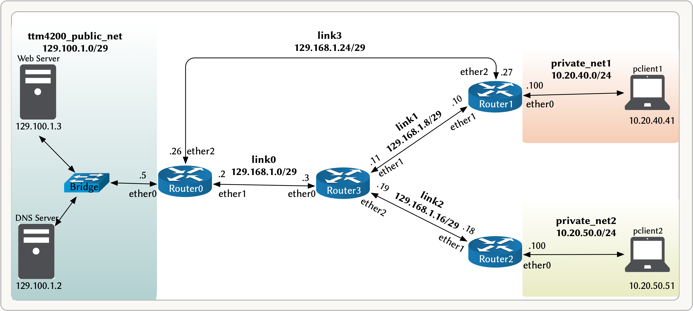

# Lab 5 -- Network Layer

## Introduction

This lab aims to introduce you to the network layer of the Internet protocol suite. In particular, you will set up and analyze a routing protocol, Network Address Translation (NAT), and Dynamic Host Configuration Protocol (DHCP).

For delivery, submit a PDF report where you answer **only** those questions marked with a **REPORT:**.


## Lab Setup

[Figure 1](#figure_1) shows the setup for this lab. It is an extension to lab2, but the servers now have public IP addresses and two other private networks. Your job is to configure a routing protocol in the routers to have full connectivity between the networks and to set up NAT to access the servers from the private networks. Additionally, you will set up DHCP to dynamically assign IP addresses to clients in private networks.


<a id='figure_1'></a>

||
|:--:| 
| *Figure 1: Lab5 Setup* |


> Read the "docker-compose.yml" file to understand the setup. 
   

- Stop and remove the containers from the previous lab, if any, before starting this lab.

```bash
cd ~/lab/lab4
docker-compose down
cd ~/lab/lab5
docker-compose up -d --build
```

- The servers are already configured, so you don't need to do anything with them. 


- To save your configuration in the routers, run the script: `sudo sh ~/work_dir/save.sh` inside the corresponding container.

```python
from test_lab5 import TestLab5
check_progress = TestLab5()
```

# Milestone 1 -- Network Addressing and Routing

## Background

In this milestone, you will learn how to set up a routing protocol. The IP addresses have already been set for simplicity, but the routers only know the directly connected networks. Thus they can not forward packets to non-directly connected networks.

- Check the routing table in the routers (router0, router1, router2, and router3) and try to understand every line in the output based on [figure 1](#figure_1).

```bash
ip route show
```

- You can try pinging the Webserver from router1. Do you get any response?

```bash
ping 129.100.1.3
```

To have connectivity, you need to update the routing tables with the correct paths to forward packets. You can do this using either static or dynamic routing:

- In static routing, you manually enter routes in the routing table, but this can be a daunting task, especially in larger networks.

- In dynamic routing, you configure a routing protocol instructing routers to exchange information with other routers, then automatically learn routes and update the routing table.
  - In distance-vector protocols (RIP, EIGRP, BGP ... etc.), routers describe available paths (i.e., routes) to their neighbors.
  - In link-state protocols (OSPF, IS-IS, ... etc.), routers describe the state of their links to all other routers.
    
In this lab., we will use OSPF as an example, but using any other routing protocol is straightforward. [OSPF](https://en.wikipedia.org/wiki/Open_Shortest_Path_First) is a link-state routing protocol in which routers describe their link-state in a message called link-state advertisement (LSA). Then each router constructs a topology map of the network and calculates the shortest path using [Dijkstra's algorithm](https://en.wikipedia.org/wiki/Dijkstra%27s_algorithm)

One open-source routing software is [FRR (Free Range Routing)](https://frrouting.org/). FRR uses the Linux kernel’s routing stack for packet forwarding and implements the most commonly used protocols, such as OSPF, RIP, BGP, IS-IS, and IGRP. FRR is already installed on the routers, and the OSPF daemon is enabled by default.


## Task 1.1 -- Configure OSPF

A nice feature of FRR is that it provides an interactive shell (`vtysh`) with CLI similar to Cisco IOS commands. There are different [modes](https://www.cisco.com/E-Learning/bulk/public/tac/cim/cib/using_cisco_ios_software/02_cisco_ios_hierarchy.htm) to the CLI, and certain commands are only available within a specific mode. Here is an example of how to configure OSPF on "router0":

* Start the CLI by running `vtysh`. This will take you to the __EXEC mode__ (notice the change in the prompt).
* Check FRR routing table: `show ip route`. You will see only directly connected routes.

* Enter the __configuration mode__: `configure terminal` (notice the change in the prompt). This will allow you to modify the running system configuration.

* Enable OSPF routing protocol: `router ospf` (notice the change in the prompt). This will take you to  __routing configuration mode__.

* Tell OSPF which interfaces to include in its link-state advertisement (LSA). You only need to specify the network address, then OSPF checks which interfaces are part of this network and include them in its LSA. Additionally, you need to specify the area:

```bash
network 129.100.1.0/29 area 0
network 129.168.1.24/29 area 0 
network 129.168.1.0/29 area 0
```
>_OSPF divides the network into routing areas to simplify administration and optimize traffic and resource utilization. For simplicity, you only use one area in this lab._
    
* Exit __configuration mode__ by entering `end` or `CTRL+Z`. This will bring you back to the __EXEC mode__. Enter `exit` if you want to return to the Linux terminal.


__Your task now is to configure OSPF on the other routers: "router1", "router2", and "router3". However, do not include the private networks (10.20.40.0/24, 10.20.50.0/24) in the link-state advertisement.__

>_If you by mistake included the private networks in the link-state advertisement, you could get rid of them by using, for example, `no network 10.20.40.0/24 area 0` in the __routing configuration mode___
   
* Ping the Webserver from router1 and ensure you can connect to it.

```python
check_progress.test_1_1()
```

## Task 1.2 -- Route-Costs


* In __router1__, start CLI and check the FRR routing table:

```bash
vtysh
show ip route
```

* Check the route towards 129.100.1.0/29, and answer the following:
  * Via which interfaces does the route passes?
  * What is the route cost?

>_We set the Individual link cost to 100. FRR displays the information \[Administrative distance/Route Cost\] in each entry of its routing table. The [administrative distance](https://docs.frrouting.org/en/latest/zebra.html#administrative-distance) allows FRR to decide what routes should be installed in the Linux kernel based upon the originating protocol. OSPF has an administrative distance of 110._

```python
# Via which interfaces does the route passes?
route_interface=  #your answer as a string: "ether1" or "ether2"
# What is the route cost?
route_cost=  # You answer as integer
check_progress.test_1_2(route_interface, route_cost)
```
## Task 1.3 -- Link Failure

* In __router0__, bring down the interface "ether2":

```bash
sudo ip link set ether2 down
```
* In __router1__, re-check the FRR routing table again and focus on the route towards 129.100.1.0/29, then answer the following:    
  * Via which interfaces does the route passes after the link failure?
  * What is the route cost after the link failure?

```python
# Via which interfaces does the route passes after the link failure?
route_interface_after_link_failure=  #your answer as a string: "ether1" or "ether2"
# What is the route cost after the link failure?
route_cost_after_link_failure=  # Your answer as integer
check_progress.test_1_3(route_interface_after_link_failure, route_cost_after_link_failure)
```

Q1. __REPORT:__ Based on [Figure 1](#figure_1) and using OSPF as an example, describe how routers detect and propagate link states through the network to build a link state database and how Dijkstra’s algorithm calculates the shortest path using this database. Then explain how the shortest path is re-calculated in case of a link failure. Support your explanation with screenshots from Wireshark of OSPF hello packets and OSPF LSA messages.

>_Hint: To capture these packets, you can bring down/up a link `sudo ip link set [interface_name] down/up`._


## Optional Task 1.4 -- Another Routing Protocol

* Configure other routing protocols, such as RIP, EIGRP, IS-IS, or BGP. For example, to configure RIP on "router0":
  *  Enable the RIP daemon in "/etc/frr/daemons" by replacing "ripd=no" to "ripd=yes". Since OSPF has a lower administrative distance than RIP, you need to disable it. Otherwise, OSPF routes will take precedence.
  * Restart FRR: `sudo service frr restart`.
  * Configure RIP using the VTY shell:

```bash
vtysh
configure terminal
router rip
network 129.100.1.0/29
network 129.168.1.24/29
network 129.168.1.0/29
end
exit
```

# Milestone 2 -- Network Address Translation (NAT)

* In __router0__, bring down the interface "ether2", if you have set it up when answering Q1.

```bash
sudo ip link set ether2 down
```

* After setting up the routing protocol, you can connect to the webserver from __"router1"__, and you can retrieve the HTML page:

```bash
wget http://129.100.1.3 --header "Host: www.ttm4200.com"
```

* However, you can not retrieve the webserver HTML page from  __"pclient1"__.

Q2. __REPORT:__ Briefly explain why you can not connect to the webserver from  __"pclient1"__. Find out where the packets get dropped and support your claim with screenshots from tcpdump.

>_Hint: You can use `tcpdump` to print packets directly on a network interface in the terminal. For example, you can enter the http get command in "pclient1": `wget http://129.100.1.3 --header "Host: www.ttm4200.com"`, then run this command `sudo tcpdump port 80 -i [interface_name] --immediate-mode -nn` on different routers to check if packets arrive at that interface (refer back to [Figure 1](#figure_1)). There can be a delay between starting `tcpdump` and printing packets in the terminal._


>_Hint: Linux Kernel enables, by default, the Reverse Path Filtering, which tests each incoming packet against the routing table and drops the packet if the __source__ address is not routable through any interface. This security feature prevents [IP Address Spoofing](https://en.wikipedia.org/wiki/IP_address_spoofing). __Optional__: if you are interested, you can read more about it [here](https://www.theurbanpenguin.com/rp_filter-and-lpic-3-linux-security/). __Optional__: if you are also interested, you can disable the Reverse Path Filtering and see the resulting behavior (in your "ntnu_server" `sudo sysctl -w net.ipv4.conf.default.rp_filter=0`, end then rebuild your containers)._


## Task 2.1 -- NAT Setup


After figuring out the previous problem's cause, you will solve it using [NAT](https://en.wikipedia.org/wiki/Network_address_translation). You can use [_nftables_](https://en.wikipedia.org/wiki/Nftables), a subsystem of the Linux kernel that provides packet filtering and NAT.


* In the containers "router1" and "router2", activate [IP Masquerading](https://tldp.org/HOWTO/IP-Masquerade-HOWTO/ipmasq-background2.5.html) to enable NAT/Masquerading for the private networks "private_net1" and "private_net2":

```bash
sudo nft add table ip nat
sudo nft 'add chain ip nat POSTROUTING { type nat hook postrouting priority 100; }'
sudo nft add rule ip nat POSTROUTING oifname "ether1" masquerade
```

> _Note: You will use nftables in the next lab to configure firewall rules and packet filtering. Thus, it can be helpful to read more about nftables, e.g., [HOWTO documentation page](https://wiki.nftables.org/wiki-nftables/index.php/Main_Page).

* Validate the NAT setup by ensuring that you can connect to the webserver from "pclient1" and "pclient2":

```bash
ping 129.100.1.3
wget http://129.100.1.3 --header "Host: www.ttm4200.com"
```

* Start a packet capture with `tcpdump` on your "pclient1" and "webserver", and save the capture to a file (e.g. "pclient1.pcap" and "webserver.pcap").

* In the "pclient1" container, retrieve the content from the webserver using:

```bash
wget http://129.100.1.3 --header "Host: www.ttm4200.com"
```

* Stop `tcpdump` capturing at "pclient1" and "webserver", and copy the capture files to your "ntnu_server" inside the lab5 folder.

```python
check_progress.test_2_1()
```

## Task 2.2 -- Analyzing Packets From The Client Perspective (Behind NAT)

Open the "pclient1.pcap" file in Wireshark. Apply the display filter `http`to show only HTTP packets, then answer the following questions:

* Find the HTTP GET sent from the client to the webserver. What are the source and destination IP addresses and TCP source and destination ports on the IP datagram carrying this HTTP GET?


* Find the corresponding 200 OK HTTP message received from the webserver. What are the source and destination IP addresses and TCP source and destination ports on the IP datagram carrying this HTTP 200 OK message?

```python
# Find the HTTP GET sent from the client to the webserver. 
#What are the source and destination IP addresses and TCP source and destination ports on the IP datagram carrying this HTTP GET?
HTTP_GET_packet_number_behind_nat=  #Your answer (an integer)
HTTP_GET_source_IP_behind_nat =  #You answer (in a string)
HTTP_GET_source_port_behind_nat =  #Your answer (an integer)
HTTP_GET_destination_IP_behind_nat =  #You answer (in a string)
HTTP_GET_destination_port_behind_nat =   #Your answer (an integer)

# Find the corresponding 200 OK HTTP message received from the webserver. 
# What are the source and destination IP addresses and TCP source and destination ports on the IP datagram carrying this HTTP 200 OK message?
HTTP_response_packet_number_behind_nat =  #Your answer (an integer)
HTTP_response_source_IP_behind_nat= #You answer (in a string)
HTTP_response_source_port_behind_nat=   #Your answer (an integer)
HTTP_response_destination_IP_behind_nat= #You answer (in a string)
HTTP_response_destination_port_behind_nat=   #Your answer (an integer)

check_progress.test_2_2(HTTP_GET_packet_number_behind_nat,
                        HTTP_GET_source_IP_behind_nat,
                        HTTP_GET_source_port_behind_nat,
                        HTTP_GET_destination_IP_behind_nat,
                        HTTP_GET_destination_port_behind_nat,
                        HTTP_response_packet_number_behind_nat,
                        HTTP_response_source_IP_behind_nat,
                        HTTP_response_source_port_behind_nat,
                        HTTP_response_destination_IP_behind_nat,
                        HTTP_response_destination_port_behind_nat)
```

## Task 2.3 -- Analyzing Packets From The Webserver Perspective (After NAT)


Open the "webserver.pcap" file in Wireshark, apply the display filter `http`. Then answer these questions:

* Find the HTTP GET message sent from the client to the webserver. What are the source and destination IP addresses and TCP source and destination ports on the IP datagram carrying this HTTP GET?

>_Self-Check: Which of these fields are the same, and which are different, compared to HTTP GET behind NAT? Why?_

* Compared to HTTP GET behind NAT, Which of the following fields in the IP datagram carrying the HTTP GET are changed: Version, Header Length, Flags, Checksum?

Q3. __REPORT:__ Briefly explain why (Version, Header Length, Flags, or Checksum) field has changed. Give two reasons.

* Find the 200 OK HTTP message. What are the source and destination IP addresses and TCP source and destination ports on the IP datagram carrying this HTTP 200 OK message?

>_Self-Check: Which of these fields are the same, and which are different, compared to the 200 OK HTTP message behind NAT? Why?_


```python
# Find the HTTP GET message sent from the client to the webserver. 
# What are the source and destination IP addresses and TCP source and destination ports on the IP datagram carrying this HTTP GET?
HTTP_GET_packet_number_after_nat= #Your answer (an integer)
HTTP_GET_source_IP_after_nat= #You answer (in a string)
HTTP_GET_source_port_after_nat=  #Your answer (an integer)
HTTP_GET_destination_IP_after_nat=  #You answer (in a string)
HTTP_GET_destination_port_after_nat=  #Your answer (an integer)

# Compared to HTTP GET behind NAT, Which of the following fields in the IP datagram carrying the HTTP GET are changed: Version, Header Length, Flags, Checksum?
Changed_field_in_HTTP_GET =  #You answer as a string of either: "Version", "Header Length", "Flags", "Checksum"

#Find the 200 OK HTTP message. What are the source and destination IP addresses and TCP source and 
#destination ports on the IP datagram carrying this HTTP 200 OK message?
HTTP_response_packet_number_after_nat = #Your answer (an integer)
HTTP_response_source_IP_after_nat= #You answer (in a string)
HTTP_response_source_port_after_nat=   #Your answer (an integer)
HTTP_response_destination_IP_after_nat= #You answer (in a string)
HTTP_response_destination_port_after_nat=   #Your answer (an integer)


check_progress.test_2_3(HTTP_GET_packet_number_after_nat,
                        HTTP_GET_source_IP_after_nat,
                        HTTP_GET_source_port_after_nat,
                        HTTP_GET_destination_IP_after_nat,
                        HTTP_GET_destination_port_after_nat,
                        Changed_field_in_HTTP_GET,
                        HTTP_response_packet_number_after_nat,
                        HTTP_response_source_IP_after_nat,
                        HTTP_response_source_port_after_nat,
                        HTTP_response_destination_IP_after_nat,
                        HTTP_response_destination_port_after_nat)

```

# Milestone 3 -- Dynamic Host Configuration Protocol (DHCP)

## Task 3.1 -- DHCP Setup

In this section, you will set up a DHCP server and a client.
We will use [ISC DHCP](https://www.isc.org/dhcp/), which offers an open-source DHCP server and client implementation. 
You will set up an authoritative DHCP server for the local network "private_net2" (see figure 1).
The server-side, _isc-dhcp-server_ is already installed in "router2", but you need to configure it.
You can read this [article](https://en.wikiversity.org/wiki/Configure_ISC-DHCP_server) on configuring an ISC-DHCP server.

* Configure the DHCP server's properties in the "/etc/dhcp/dhcpd.conf" file. You can start with this template:
   
```bash
#declare this DHCP server as authoritative
==fill here==;
#specify a subnet and its netmask
subnet ==fill here== netmask ==fill here== {

  #specify a range of addresses the server can offer
  #(exclude the router IP from this range)
  range ==fill here==  ==fill here== ;

  option domain-name-servers 129.100.1.2; 
  option domain-name "ttm4200.com";
  option routers 10.20.50.100;
}
default-lease-time 600;
max-lease-time 7200;
```


* Activate DHCP on the interface "ether0" by editing the "/etc/default/isc-dhcp-server" configuration file (comment "INTERFACESv6").

```bash
INTERFACESv4="ether0"
#INTERFACESv6=""
````
* Check the syntax of the server configuration file for any errors: 

```bash
dhcpd -t
```

* Restart the dhcp server: 

```bash
sudo service isc-dhcp-server restart
```

* Start packet capturing in "router2" on "ether0" interface:

```bash
sudo tcpdump -i ether0 -w dhcp.pcap
```

* On the client-side, [_dhclient_](https://linux.die.net/man/8/dhclient) is already installed in "pclient2". You will use this client for retrieving a DHCP lease.

* In "pclient2", release any existing DHCP client lease:

```bash
sudo dhclient -r -v

```

* Request a new IP address from a DHCP server:

```bash
sudo dhclient -v
```

* Then, __again__, release the lease.

>_You might lose SSH connection to "pclient2". You can reconnect using `docker attach pclient`. Ignore the error message "System has not been booted with systemd as init system (PID 1). Can't operate.". This message is systemd-related because we are running Linux in a container ([for more information](https://stackoverflow.com/questions/39169403/systemd-and-systemctl-within-ubuntu-docker-images#answer-39169889))

* Stop the packet capture and copy the capture file to your "ntnu_server", inside the lab5 folder.


## Task 3.2 -- Analyzing DHCP Packets

Open the capture file "dhcp.pcap" in Wireshark and display only DHCP frames (apply the display filter `dhcp` ). Then answer the following questions:

* What is the packet number (packet ordinals in the capture file) of the four DHCP messages (Discover, Offer, Request, and ACK)?

* Are DHCP messages sent over UDP or TCP? 

* What is the value of the Transaction-ID in each of the four (Discover/Offer/Request/ACK) DHCP messages?  
 

* What are the source and destination IP addresses for each of the four DHCP messages (Discover/Offer/Request/ACK DHCP)? 

Q4. __REPORT:__ Based on your reading of the Book, are the source and destination IP addresses of the four DHCP messages what you expected? Briefly explain why?

* What is the router and subnetmask in the DHCP offer message? 

* How long is the IP address lease time?

* Does the DHCP server acknowledge the DHCP release message?

```python
# What is the packet number (packet ordinals in the capture file) of the four DHCP messages (Discover, Offer, Request, and ACK)?

DHCP_Discover_packet_number=  #Your answer as integer
DHCP_Offer_packet_number=  #Your answer as integer
DHCP_Request_packet_number=  #Your answer as integer
DHCP_ACK_packet_number=  #Your answer as integer

# Are DHCP messages sent over UDP or TCP? 
DHCP_transport_protocol =   # your answer as a string of "UDP" or "TCP"

# What is the value of the Transaction-ID in each of the four (Discover/Offer/Request/ACK) DHCP messages?
Transaction_ID=  #You answer as an integer (decimal or hexadecimal preceded with 0x)


# What are the source and destination IP addresses for each of the four DHCP messages (Discover/Offer/Request/ACK DHCP)? 
DHCP_Discover_source_IP=   #Your answer as a string of IP address
DHCP_Discover_destination_IP=   #Your answer as a string of IP address
DHCP_Offer_source_IP=  #Your answer as a string of IP address
DHCP_Offer_destination_IP=   #Your answer as a string of IP address
DHCP_Request_source_IP=  #Your answer as a string of IP address
DHCP_Request_destination_IP=  #Your answer as a string of IP address
DHCP_ACK_source_IP=  #Your answer as a string of IP address
DHCP_ACK_destination_IP=  #Your answer as a string of IP address


# What is the router and subnetmask in the DHCP offer message? 
DHCP_Offer_router =  #Your answer as a string of IP address
DHCP_Offer_subnetmask =  #Your answer as a string of subnet mask

# How long is the IP address lease time (in seconds)?
IP_lease_time =  #Your answer as integer 

# Does the DHCP server acknowledge the DHCP release message?
server_acknowledge_release_message = # Your answer as a boolean (True or False)
    
from test_lab5 import TestLab5
check_progress = TestLab5()
check_progress.test_3_1(DHCP_Discover_packet_number,
                        DHCP_Offer_packet_number,
                        DHCP_Request_packet_number,
                        DHCP_ACK_packet_number,
                        DHCP_transport_protocol,
                        Transaction_ID,
                        DHCP_Discover_source_IP,
                        DHCP_Discover_destination_IP,
                        DHCP_Offer_source_IP,
                        DHCP_Offer_destination_IP,
                        DHCP_Request_source_IP,
                        DHCP_Request_destination_IP,
                        DHCP_ACK_source_IP,
                        DHCP_ACK_destination_IP,
                        DHCP_Offer_router,
                        DHCP_Offer_subnetmask,
                        IP_lease_time,
                        server_acknowledge_release_message)
```


